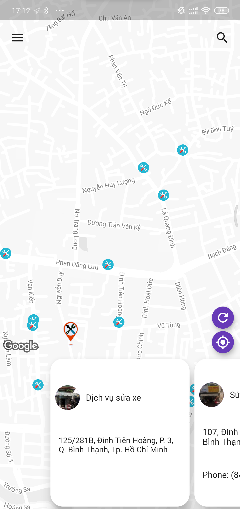
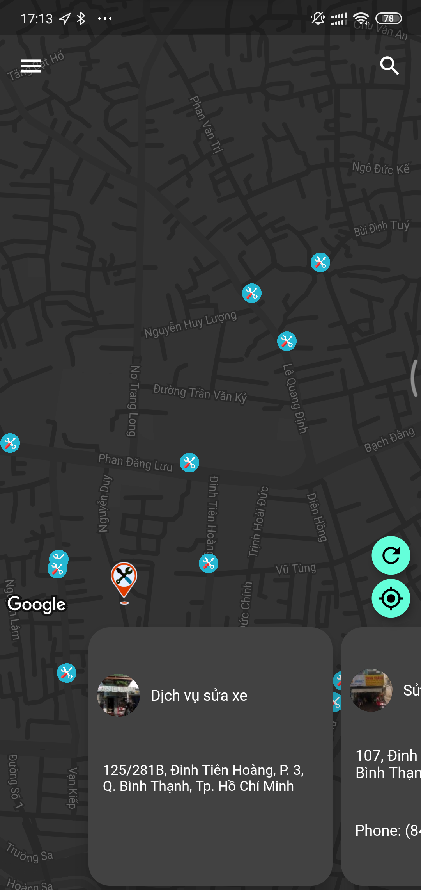

# FixMap

Language: [Tiếng Việt](https://github.com/nploi/fix_map/blob/master/README.md) |  [English](https://github.com/nploi/fix_map/blob/master/README-en.md) 

FixMap is the application that helps you find the nearest car repair center for you

## Features
- This application uses Flutter with the Bloc model
- Find a place to repair cars around here
- Review car repair
- Log in, log out
- Light mode, Dark mode
- Online, offile
- Languages

    |Language|Code||
    |---|---|---|
    |Tiếng việt (Vietnamese)|vi| :heavy_check_mark:|
    |Tiếng Anh (English)|en|:heavy_check_mark:  |

## Screenshot
------
| Light mode |  Dark mode |
|---|---|
|   |   |
|   |   |
|   |   |
